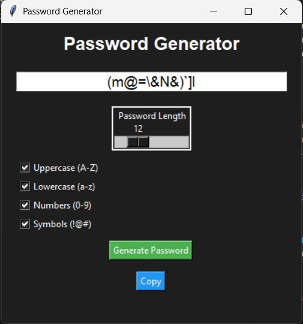

# 🔐 Password Generator (Tkinter)

A modern and user-friendly password generator built using Python and Tkinter.
This desktop application allows users to generate secure passwords with customizable options.

---

## 🚀 Features

* 🎚️ Adjustable password length (6–32 characters)
* 🔤 Include uppercase letters (A–Z)
* 🔡 Include lowercase letters (a–z)
* 🔢 Include numbers (0–9)
* 🔣 Include symbols (!@#...)
* 🔐 One-click password generation
* 📋 Copy password to clipboard
* 🎨 Clean dark-themed UI

---

## 📸 Preview



---

## 🛠️ Tech Stack

* Python 🐍
* Tkinter (GUI)
* random & string modules

---

## 📂 Project Structure

```bash
PASSWORD GENERATOR/
│── main.py
│── README.md
│── image.png
```

---

## ▶️ How to Run

```bash
git clone https://github.com/r-amani/Password-Generator.git
cd password-generator
python main.py
```

---

## 📥 Download (EXE)

Download the latest version (no Python required):

👉 https://github.com/r-amani/Password-Generator/releases/tag/v1.0

---

## 🧠 How It Works

* User selects password length using a slider
* Chooses character types using checkboxes
* App builds a character pool dynamically
* Random characters are selected to generate a secure password
* Password can be copied to clipboard instantly

---

## ⚡ Key Concepts Used

* Event-driven programming
* Tkinter widgets (Entry, Scale, Checkbutton, Button)
* BooleanVar for state management
* Random password generation
* Clipboard handling

---

## 🔮 Future Improvements

* 💪 Password strength indicator
* 👁️ Show/Hide password
* 📂 Save generated passwords
* 🎨 Advanced UI styling
* 🔑 Password history

---

## ⚠️ Note

Windows may show a warning for the `.exe` file (unknown publisher).
This is normal for unsigned applications.

---

## ⭐ Support

If you like this project, consider giving it a ⭐ on GitHub!

---

## 👨‍💻 Author

Sujan Ramani
Aspiring Developer 🚀
